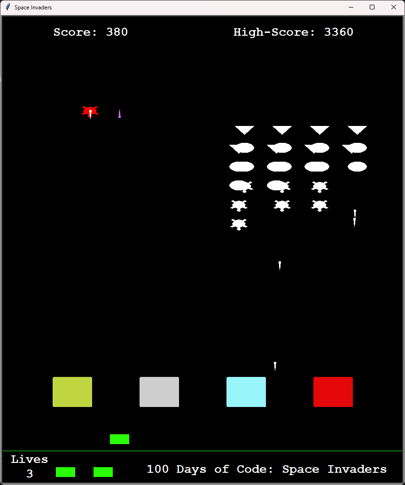

# 100 Days of Code Day 95: Space Invaders Clone 

## Introduction
This is the repo for day 95 of the 100 Days of Code course. Day 95's goal was to create a clone of the Space Invaders video game.

The program is divided into separate files, leveraging **object-oriented programming** concepts. Here is a list of the files used. The **Project Files section** provides further detail on each file.
-	Aliens.py
-	Laser.py
-	Main.py
-	Player.py
-	Scoreboard.py
-	Highscore.txt

If you want to see screenshots of the program, there are a few saved under the [screenshots folder](/screenshots).
## Modules Used
### Turtle Graphics
The **Turtle graphics** module is used to render all the GUI elements in this game. This includes:
-	Creating alien objects
-	Creating Lasser objects
-	Creating the player’s bunkers
-	Creating the player’s cannon
-	Writing on the screen
-	Handling the player and alien’s movements. 
### Random
**Random** is used to randomize elements of the game for the alien objects. This includes selecting which alien fires a laser, how often an alien would fire a laser, and the chance of the red alien spawning in the game.
## Project Files
### Aliens.py
The **aliens.py** file contains the **Alien class**, which is used to create an alien object as well as control the alien's movement. Additionally, the file has a function to spawn a **red alien**, which has different behavior from the standard white aliens. 

Functions that spawn alien objects in rows are also located in this file. Those rows are managed by populating five separate lists, which are then passed into a master list in main.py.
### Laser.py
**Laser.py** has two **separate classes** for the **Laser object**. One for the player, and a separate one for the alien’s laser. This probably could have been condensed down to a single class since both laser classes perform the same functionality, but I chose to create one for the player and aliens. Additionally, the Alien class has an additional method to position the laser at an alien's position inside the class. This method is used by white aliens. One laser to each row of aliens (five total), so the laser would be fired from an alien inside of a row from an alien for each row.
### Main.py
**Main.py** ties everything together. The file imports all the files listed in this section, creates the objects, and carries out the game's logic. The **Project Walkthrough section** will provide further details.
### Player.py
The **player.py** file contains the **Cannon class**, which is controlled by the player. The cannon class has methods to control its movement and reset it to its starting position if it is hit by an alien.

Additionally, the file contains the **Bunker class**, which is used to create the player’s bunkers. The class tracks the bunker’s health, and when a bunker is hit, its color changes to signify that it has been damaged! Four total bunkers are generated and populated into a list using a function. The reason I chose to go with four large bunker objects instead of bunkers composed of smaller bricks is that the game would move very slowly if I were to compose the bunkers of multiple small bricks. *This is an issue when too many objects are rendered on the screen*.
### Scoreboard.py
**Scoreboard.py** is responsible for making the screen look pretty as well as keeping track of the **score**, **high score**, and **player's lives**. If the player’s current score is higher than the high score, then the high score file is overwritten. The high score is tracked and saved in **highscore.txt** and is opened when the game is launched.
### Highscore.txt
**Highscore.txt** tracks the highest score recorded by a player. If the current game’s high score is higher than the score saved in the file, the file is overwritten with a new high score.
## Project Walkthrough
### Setup
The program first starts by importing the classes and functions from the various files listed above. Additionally, the program has starting variables defined that include the following:
-	Player’s starting position
-	Level and number of aliens destroyed
-	Starting position for the aliens
-	Variables that hold the coordinates used by the alien’s lasers

The program has two functions in main.py, These are used to set up the aliens at each level. There are a total of 9 levels in the game, and each time a new level is started, the game gets slightly harder with the alien’s movement speed increasing and their position starting closer to the player.

With those functions and variables defined, the last step completed before the game’s logic is executed is to set up the objects on screen. After they are set up, the game is ready to start.
### Gameplay
Once the game begins, the program is constantly checking to see if conditions for the next level have been met and if the game is over.

The aliens are rendered in five separate rows and move in one direction. Once the aliens hit the wall, they move forward closer to the player. While the aliens are on the screen, there is a random chance that one of the aliens from each row will shoot a laser at the player. If all the white aliens are destroyed at the current level, the next level is achieved. And a new set of aliens is respawned closer to the player.

While the game is true, there is a chance that a red alien will spawn on the screen. This alien's movement is different from the other aliens. Additionally, when this alien is destroyed, the player will receive additional points for destroying it. Below is a table highlighting the points that can be earned for destroying each type of alien.

| Alien Type           | Points awarded |
| :------------------- | :------------: |
| White turtle         | 10 Points      |
| White circle         | 20 Points      |
| White triangle       | 30 Points      |
| Red triangle         | 100 Points     |

On the player’s side, the player’s cannon is controlled by the left and right arrow keys. The player can also fire a shot by pressing the space key. The player also starts with four bunkers to protect themselves from the aliens' cannon fire. Each bunker can take up to 8 hits before being removed from the game.

The game ends when any of the following conditions are met:
-	All levels are cleared.
-	Players runs out of lives (either being hit by an alien’s laser or the aliens reaching the bottom of the screen).

Once the game ends, the game’s current score is compared against the high score value. If a new high score is achieved, the previous high score is overwritten.

## Project Screenshots
Screenshots for this project can be found in the [screenshots folder](/screenshots).